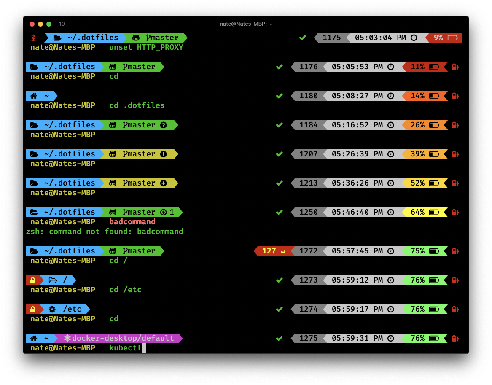
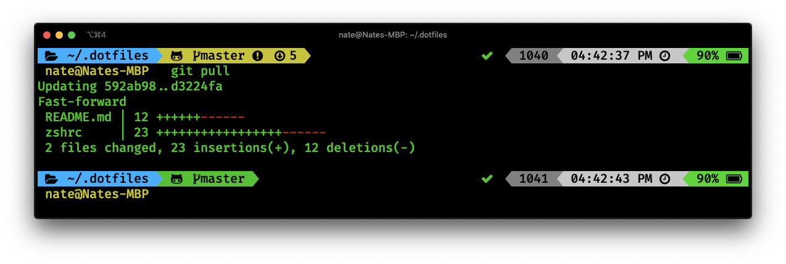
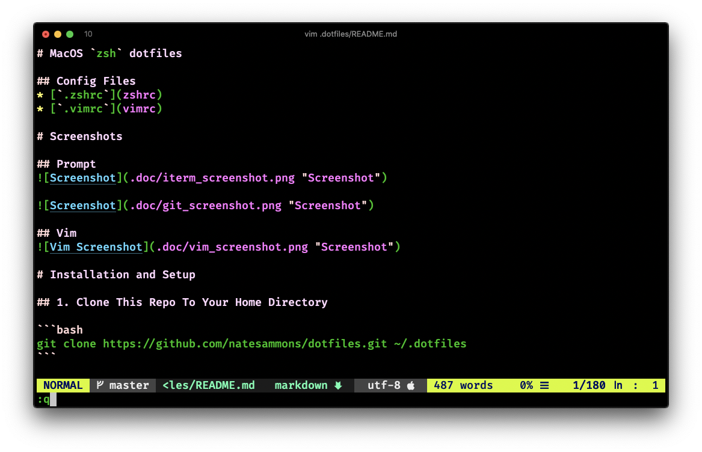

# MacOS `zsh` dotfiles

## Config Files
* [`.zshrc`](zshrc)
* [`.vimrc`](vimrc)

# Screenshots

## Prompt




## Vim


# Installation and Setup

## 1. Clone This Repo To Your Home Directory

```bash
git clone https://github.com/natesammons/dotfiles.git ~/.dotfiles
```

## 2. Install Homebrew
Follow the instructions at [https://brew.sh/](https://brew.sh/)

```bash
/usr/bin/ruby -e "$(curl -fsSL https://raw.githubusercontent.com/Homebrew/install/master/install)"
```

### Install Core Tools

```bash
brew install coreutils
brew install findutils
brew install gnu-indent
brew install gnu-sed
brew install gnutls
brew install grep
brew install gnu-tar
brew install gawk
brew install diffutils
brew install gnu-which
brew install gzip
brew install wget
brew install less
brew install openssh
brew install rsync
brew install vim
brew install htop
brew install watch
brew install zstd
brew install awscli
brew install zsh
brew install zsh-syntax-highlighting
brew install zsh-completions
```

### Fix `zsh-completions` permissions

Fix for the following error with zsh completions:

```bash
zsh compinit: insecure directories, run compaudit for list.
# Ignore insecure directories and continue [y] or abort compinit [n]?
```

Run the following (inside `zsh`):

```bash
zsh
compaudit | xargs chmod g-w
```

See [this stackexchange.com thread](https://unix.stackexchange.com/questions/383365/zsh-compinit-insecure-directories-run-compaudit-for-list) for details.


## 3. Install the FiraCode "Nerd Font" font

[https://nerdfonts.com/](https://nerdfonts.com/)

```bash
brew tap homebrew/cask-fonts
brew cask install font-firacode-nerd-font
```

Open the FontBook app, and it should show up under user fonts.  Select this as the font to use in iTerm.

## 4. Make `zsh` your default shell

### Update Available Shells
Edit `/etc/shells` to add zsh from brew. Add the following lines:

```bash
# from brew
/usr/local/bin/zsh
```

### Change default shell for your user

```bash
chsh -s /usr/local/bin/zsh
```

Without this you will use the old version of zsh that ships with MacOS.

## 5. Install oh-my-zsh for `zsh`

Follow the instructions at [https://ohmyz.sh/](https://ohmyz.sh/)

[https://github.com/robbyrussell/oh-my-zsh](https://github.com/robbyrussell/oh-my-zsh)

```bash
sh -c "$(curl -fsSL https://raw.githubusercontent.com/robbyrussell/oh-my-zsh/master/tools/install.sh)"
```

This will nuke your `.zshrc` so don’t make changes before installing it.  Run through the wizard and select the defaults.


### Install the `powerlevel10k` theme

[https://github.com/romkatv/powerlevel10k](https://github.com/romkatv/powerlevel10k)

```bash
git clone https://github.com/romkatv/powerlevel10k.git ~/.oh-my-zsh/custom/themes/powerlevel10k
```
Powerlevel10K is a [Powerlevel9k](https://github.com/bhilburn/powerlevel9k) re-implementation
that is a lot faster.

## 6. Install `Vundle` plugin for `vim`

[https://github.com/VundleVim/Vundle.vim](https://github.com/VundleVim/Vundle.vim)

```bash
git clone https://github.com/VundleVim/Vundle.vim.git ~/.vim/bundle/Vundle.vim
```

## 7. Symlink `.zshrc` and `.vimrc` to this repo

Replaces these files in your home dir with symlinks to these files.

```bash
cd ~/.dotfiles
bash ./create-links.sh
```

# 8. Run `vim` to initialize newly-configured plugins

Run `vim` to install plugins:

```bash
vim +PluginInstall +qall
```

# 9. Launch a new terminal

It should look like the screenshot above

# 10. Updates

```bash
brew update
brew upgrade
git -C ~/.oh-my-zsh pull
git -C ~/.oh-my-zsh/custom/themes/powerlevel10k pull
git -C ~/.vim/bundle/Vundle.vim pull
git -C ~/.dotfiles pull
vim +PluginUpdate +qall
```

# 11. Customize

The [`.zshrc`](zshrc) config sources files named `*.sh` in each of the following directories after setting everything else:

* `~/.zsh.d`
* `~/.zsh.d.${USER}`
* `~/.zsh.d.$(hostname -s)`

Files in each of these directories are run in alphabetic order (using `sort` on filenames)


